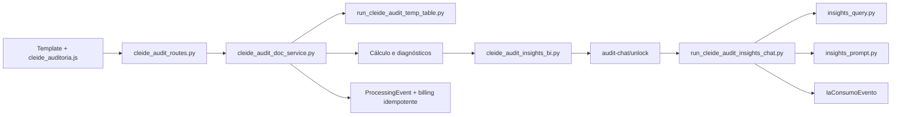

# Arquitetura Oficial

Referência: `homolog@6701a53`, 2026-07-16.

## Mapa de superfícies

| Superfície | Acesso | Responsabilidade |
|---|---|---|
| `/` | público/logado | discovery Cleiton ou Júlia operacional |
| `/chat_julia?mode=operational` | autenticado | consultoria e documentos da Júlia |
| `/fretes` | autenticado | upload, BI, previsão e chat Roberto |
| `/auditoria-frete` | página pública; API protegida | auditoria Cleide |
| `/cleide-bi-frete` | autenticado | BI Cleide anterior, legado |
| `/feed` | público | editorial |
| `/admin/...` | admin | configuração e observabilidade |

## Fluxo da auditoria

`app/cleide_audit_insights_context.py` monta e valida o bundle fechado do lote, incluindo `batch_scope`, resultados mesclados, cobertura, fiscal, diagnósticos e foco. Consultas exatas são determinísticas; IA é usada para interpretação textual dentro do contexto sanitizado. O dashboard e o chat compartilham o lote, mas o chat só abre após o backend validar BI pronto.

## Camadas transversais

- autenticação e retorno seguro: `app/web.py`, `app/capability_taxonomy.py`;
- discovery: `app/run_cleiton_discovery.py` e `app/copilot_capabilities.*`;
- autorização: `app/services/cleiton_operacao_autorizacao_service.py`;
- billing: `app/services/cleiton_upload_billing_service.py`;
- custo: `app/services/cleiton_cost_service.py`;
- IA/observabilidade: `app/services/ia_metrics_service.py` e governança Gemini;
- persistência temporária: `app/cleiton_doc_tmp/`, nunca banco definitivo;
- testes: `tests/`, organizados por domínio e contrato de interface.

Detalhes da auditoria estão em `docs/cleide_auditoria_operacional.md`; não duplique esse contrato em novos guias.
