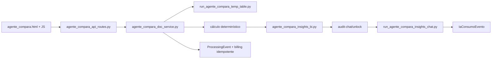

# Arquitetura Oficial

Referência auditada no código em 2026-07-20, com `homolog@c2575f8` como fotografia local da entrega Agente Compara.

## Mapa de superfícies

| Superfície | Acesso | Responsabilidade |
|---|---|---|
| `/` | público/logado | discovery Cleiton ou Júlia operacional |
| `/chat_julia?mode=operational` | autenticado | consultoria e documentos da Júlia |
| `/fretes` | autenticado | upload, BI, previsão e chat Roberto |
| `/auditoria-frete` | página pública; API protegida | auditoria Cleide |
| `/agente-compara` | página pública; API protegida | fluxo comparativo/auditoria Agente Compara |
| `/cleide-bi-frete` | autenticado | BI Cleide anterior, legado |
| `/feed` | público | editorial |
| `/admin/...` | admin | configuração, billing e observabilidade |

## Aplicação e blueprints

`app/web.py` registra os blueprints:

- `admin_bp`
- `ops_bp`
- `user_bp`
- `cleide_bp`
- `cleide_audit_bp`
- `agente_compara_bp`
- `agente_compara_api_bp`
- `julia_documents_bp`

Não há blueprint separado para Roberto: suas rotas permanecem no `web.py` principal.

## Fluxo de autenticação e autorização

- login por senha e OAuth Google;
- `_safe_next_redirect` aceita apenas caminhos internos seguros e rejeita `/api` e `/admin`;
- APIs protegidas retornam `401` em JSON;
- operações autenticadas de Júlia, Roberto, Cleide e Agente Compara passam por `avaliar_autorizacao_operacao_por_franquia`.

## Armazenamento documental temporário

A trilha documental compartilhada usa `app/cleiton_doc_store.py` e `app/cleiton_doc_tmp/`:

- metadados persistidos em JSON técnico por `doc_id`;
- sem conteúdo bruto persistente no banco;
- limpeza por TTL e `.cleanup_meta.json`;
- ownership validado por `source_agent` e `session_key` antes de remoção física;
- isolamento entre Júlia, Cleide Auditoria e Agente Compara confirmado por testes.

## Fluxos principais

### Júlia

- upload/lista/remoção/limpeza em `/api/julia/documents/*`;
- usa o trilho documental do Cleiton, sem `temp_table` própria nesta camada;
- contexto montado para `POST /api/chat_julia`;
- comportamento confirmado por `tests/test_julia_documents_api.py` e `tests/test_julia_chat_documental.py`.

### Cleide Auditoria

- `temp_table` revisável, coverage, template oficial, upload do lote, `audit/run`, correções e chat analítico pós-BI;
- chat documental e chat pós-BI são fluxos distintos;
- billing operacional e consumo de IA permanecem separados.

### Agente Compara

- arquitetura paralela à da Cleide Auditoria, com namespace, IDs de sessão, `flow_type` e billing próprios;
- usa template oficial `app/protected_files/templates/template_agente_compara.xlsx`;
- arquivo operacional padrão (9 colunas): `numero_documento, cidade_origem, uf_origem, cidade_destino, uf_destino, valor_nf, peso, modal, data_emissao` — a transportadora vem da tabela cadastrada (`carrier_name`), não por linha; `transportadora`/`data_entrega`/`valor_frete` são toleradas como legado e ignoradas;
- APIs protegidas em `/api/agente-compara/*`;
- isolamento frente à Cleide confirmado por `tests/test_agente_compara_isolation.py`.

### Roberto

- upload, BI e chat governado em `/fretes` e `/api/chat_roberto`;
- BI e previsão estatística usam processamento não-LLM e chat explicativo separado;
- autenticação obrigatória.

## Camadas transversais

- monetização operacional: `Franquia`, `CleitonBillingApropriacao`, `CleitonCostConfig` e serviços Cleiton;
- observabilidade IA: `IaConsumoEvento`;
- observabilidade de processamento: `ProcessingEvent`;
- snapshots de custo real: `IaBillingCostSnapshot` via cron `billing-snapshot`;
- administração: rotas `/admin/...` e serviços de dashboard.

## Infraestrutura versionada

- `start.sh` aplica `db upgrade` antes do Gunicorn;
- `render.yaml` versionado declara `homolog` para homologação e `main` para produção, o que diverge do processo operacional informado para `producao`;
- `render.yaml` usa `healthCheckPath: /health`, mas o código expõe `/health/liveness` e `/health/readiness`.

Essas duas divergências são documentais/operacionais e devem ser validadas fora do repositório antes de deploy.
