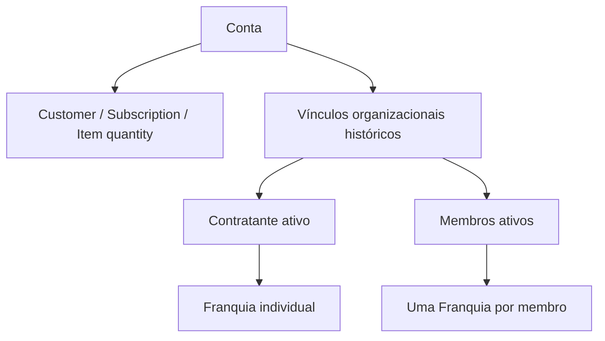

# Arquitetura do Produto

Referência revisada em 2026-09-19. O código atual é a fonte de verdade.

## Identidade do produto

- produto: `AgenteFrete`
- empresa: `Logcompleta Agentes Inteligentes LTDA`
- domínio principal: `https://www.agentefrete.com.br/`
- stack principal: Flask + templates + Bootstrap

## Experiência pública versus autenticada

- a home pública é uma superfície de discovery do AgenteFrete;
- a home pública não deve ser documentada como Julia pública principal;
- a superfície operacional autenticada da Julia continua em `/chat_julia?mode=operational`;
- a aplicação reúne superfícies públicas, autenticadas, administrativas e operacionais na mesma base Flask.

## Superfícies principais

| Superfície | Acesso | Papel atual |
|---|---|---|
| `/` | público/logado | home, discovery, onboarding e CTA experimental |
| `/chat_julia` | autenticado em `mode=operational` | superfície operacional da Julia/AgenteFrete |
| `/auditoria-frete` | página pública; APIs autenticadas | AgenteAudita (APIs técnicas `/api/cleide-auditoria/*`) |
| `/agente-compara` | página pública; APIs autenticadas | comparação multitabela |
| `/fretes` | autenticado | Roberto BI e chat quantitativo |
| `/feed` | público | feed editorial misto |
| `/contrate-um-plano`, `/perfil/*` | autenticado | billing e área do usuário |
| `/gestao-multiuser` | contratante ativo | membros, convites e capacidade |
| `/convite/<token>` | token; aceite autenticado | ingresso explícito Multiuser |
| `/admin/*` | admin global | dashboards, configuração, titularidade e governança |
| `/cron/*`, `/ops/*`, `/health*` | operacional | automação, suporte e health |

## Domínios e agentes

### AgenteFrete e Julia

- AgenteFrete é a identidade priorizada nas superfícies públicas
- Julia continua como identidade operacional interna e autenticada
- o chat autenticado pode usar contexto documental temporário governado pelo Cleiton
- após a resposta normal, o AgenteFrete operacional pode oferecer orientação determinística para ferramentas internas, sem segunda chamada LLM, com URLs da taxonomy, abertura em nova aba e fail-open; casos ambíguos não recebem handoff automático

### AgenteAudita

- identidade pública da auditoria de fretes
- identidade técnica/histórica: Cleide
- rota pública: `/auditoria-frete`
- APIs autenticadas: `/api/cleide-auditoria/*`
- fluxo com upload, `temp_table`, coverage opcional, lote auditado, BI executivo e chat analítico
- isolamento de sessão, eventos, billing e artefatos

### AgenteCompara

- comparação de 2 tabelas obrigatórias e 1 opcional
- fluxo com `comparison_id`, `table_id` e `slot`
- revisão, cálculo comparativo, analytics, memória pública e chats separados

### Roberto

- domínio de BI de fretes em `/fretes`
- upload, leitura quantitativa e chat autenticado
- documentar somente o que está implementado, separando eventuais visões futuras

### Cleiton

- camada transversal de governança
- franquias, autorização operacional, billing técnico, configuração documental e observabilidade
- também governa parte do discovery e das rotas cron

## Composição técnica

- núcleo Flask em `app/web.py`;
- blueprints ativos incluem admin, ops, user, Cleide legado (`cleide_bp`), AgenteAudita (`cleide_audit_bp`), AgenteCompara (`agente_compara_bp` e `agente_compara_api_bp`) e documentos da Julia (`julia_documents_bp`);
- Roberto, OAuth, onboarding, newsletter, webhooks e rotas gerais permanecem no `app/web.py`;
- persistência transacional em PostgreSQL via `DATABASE_URL`;
- schema evoluído via Alembic;
- persistência técnica em disco para documentos, índices, resultados e artefatos temporários.

## Organização comercial Multiuser V1

O [Multiuser V1](multiuser_v1.md) está implantado. `Conta` é a raiz comercial; `ContaVinculoOrganizacional` registra contratante/membro e histórico. Cada usuário ativo ocupa uma Franquia individual, inclusive o contratante. Capacidade contratada e ciclo são da Conta; consumo é individual. Stripe mantém um Customer, uma Subscription e um Item com quantity de assentos.

`User.categoria` define plano; `User.is_admin` define admin global. Não existe org-admin. Blueprints Multiuser cobrem painel e convites, com serviços de contratação, ciclo, aumentos, redução, revogação, titularidade e diagnóstico. Endpoints internos não equivalem a API pública Multiuser.

## Isolamento entre domínios

- Julia, o domínio técnico Cleide e AgenteCompara usam chaves e escopos distintos em sessão;
- AgenteAudita/Cleide e AgenteCompara compartilham parte do trilho técnico documental do Cleiton, mas não compartilham identidade funcional;
- AgenteCompara usa storage comparativo próprio;
- AgenteAudita usa coverage, lote e contexto analítico próprios;
- billing e eventos não devem ser misturados entre os domínios;
- billing e observabilidade não devem ser documentados como compartilhados indistintamente;
- membros da mesma Conta não compartilham documentos, chats, uploads, tabelas, resultados ou memória privada: `conta_id` não substitui ownership de usuário/sessão;
- revogação encerra vínculo/acesso, preserva User, Franquia e histórico/consumo; reentrada exige aceite e não reseta consumo.

## Persistência e runtime

- `DATABASE_URL` é a fonte de persistência transacional;
- `APP_DATA_DIR` sustenta storage técnico persistente fora da sessão;
- `INDICES_FILE_PATH` fica fora da pasta efêmera da release em homolog/prod;
- o schema evolui via Alembic;
- `start.sh` executa `db upgrade` antes do Gunicorn;
- `render.yaml` versionado define homologação na branch `homolog` com `APP_ENV=homolog` e produção na branch `producao` com `APP_ENV=prod`;
- os dois serviços versionados usam `autoDeploy: true`, `build.sh`, `start.sh` e `healthCheckPath: /health`;
- quando `APP_ENV` não vem explícito, `start.sh` reconhece `main`, `master`, `producao` e `prod` como ambiente de produção;
- o runtime também expõe `/health/liveness` e `/health/readiness`.

Head atual: `f7g8h9i0j1k2`. Cadeia canônica em [Banco e Migrations](DATABASE_AND_MIGRATIONS.md).

## Home e experimento de CTA

- a home registra assignment e telemetria do experimento `home_chat_cta_v1`;
- a tabela isolada é `home_cta_experiment_event`;
- usuários anônimos recebem assignment aleatório por sessão;
- usuários autenticados recebem assignment determinístico derivado de `user.id`, sem persistir esse id em claro na tabela;
- eventos de `impression` e `conversion` são fail-open;
- a tabela não reutiliza `FunnelEvent` e não cria relacionamento com `User`, `Conta` ou `Franquia`.

## Relações importantes

- autenticação e lifecycle do usuário convivem com billing e auditoria, mas não apagam estrutura contratual;
- documentos legais têm governança própria por upload/admin e storage persistente;
- consentimento de marketing é separado de cookies/sessão necessários;
- masking para IA externa acontece na boundary outbound, não no dado persistido interno;
- billing técnico e observabilidade passam pelo Cleiton, com eventos e apropriações por domínio.
