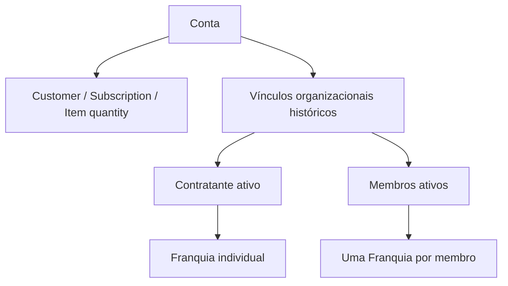

# Arquitetura do Produto

Referência revisada em 2026-09-23 (Sprint 12). O código atual é a fonte de verdade; o release de produção informado é `fa98317`.

## Identidade do produto

- produto público: **AgenteFrete**
- definição: Assistente virtual especializado em logística da LogCompleta
- empresa: `Logcompleta Agentes Inteligentes LTDA`
- domínio principal: `https://www.agentefrete.com.br/`
- stack principal: Flask + templates + Bootstrap + JS vanilla
- nomes internos (Júlia, Roberto, Cleide, Cleiton, AgenteCompara) são módulos/personas técnicas, não produtos públicos separados

## Experiência pública versus autenticada

- home pública `/`: discovery do AgenteFrete + habilidades sugeridas
- não documentar a home como “Julia pública principal”
- chat operacional autenticado: `/chat_julia?mode=operational` com identidade pública **AgenteFrete** (nome de rota técnico preservado)
- histórico do chat operacional: client-side; sem threads persistentes de produto
- a aplicação reúne superfícies públicas, autenticadas, administrativas e operacionais na mesma base Flask

## Superfícies principais

| Superfície | Acesso | Papel atual |
|---|---|---|
| `/` | público/logado | home, discovery, habilidades e CTA experimental |
| `/chat_julia?mode=operational` | autenticado | chat operacional AgenteFrete |
| `/auditoria-frete` | shell; APIs autenticadas | AgenteAudita (`/api/cleide-auditoria/*`) |
| `/agente-compara` | shell; APIs autenticadas | comparação multitabela |
| `/fretes` | autenticado (`@login_required`) | Roberto BI e chat quantitativo |
| `/feed`, `/noticia/<id>` | público | Feed editorial (news / analysis / evergreen) |
| `/contrate-um-plano`, `/perfil/*` | autenticado | billing e área do usuário |
| `/gestao-multiuser` | contratante ativo | membros, convites e capacidade |
| `/convite/<token>` | token; aceite autenticado | ingresso explícito Multiuser |
| `/acesso-desktop` | público | landing de campanha opcional/legada — **não** gate técnico |
| `/login` | público | autenticação; preserva `next` interno seguro |
| `/admin/*` | admin global | dashboards, configuração editorial, governança |
| `/cron/*`, `/ops/*`, `/health*` | operacional | automação, suporte e health |

## Shell, habilidades e autenticação

- catálogo único: `app/shell_navigation.py` (desktop, mobile e cards da Home)
- habilidades Home: Analisar fretes, Auditar cobranças de frete, Comparar tabelas
- shell: Consultar o AgenteFrete + as três acima + Feed
- destinos protegidos usam `/login?next=<canônica>`
- `_safe_next_redirect` rejeita URL absoluta, scheme externo, `//`, paths `/api/*` e `/admin*`
- `/fretes` não entra no sitemap público

## Tema global

- preferências: `system` | `dark` | `light`
- persistência: `localStorage` `af-theme`
- contrato em `base.html` + `agentefrete-theme.css`
- **sem** opt-in por página (`af_theme_enabled` removido)
- `system` segue `prefers-color-scheme`
- `base_admin.html` e `/acesso-desktop` fora do contrato

## Domínios e agentes

### AgenteFrete (público) e módulo técnico Julia

- AgenteFrete é a identidade nas superfícies voltadas ao usuário
- módulos `julia_*` / rotas `chat_julia` são compatibilidade técnica
- Júlia editorial permanece no pipeline de conteúdo
- orientação determinística pós-resposta para ferramentas internas (sem 2ª LLM; fail-open)

### AgenteAudita / Cleide

- identidade pública AgenteAudita; técnica Cleide
- `/auditoria-frete` + `/api/cleide-auditoria/*`
- isolamento de sessão, eventos, billing e artefatos

### AgenteCompara

- 2 tabelas obrigatórias + 1 opcional
- `comparison_id` / `table_id` / `slot`
- storage e billing próprios

### Roberto

- `/fretes` autenticado: upload, BI e chat quantitativo

### Cleiton

- governança transversal: franquias, billing técnico, discovery, cron, orquestração editorial (incl. evergreen)

## Editorial e evergreen

- intenções: `news`, `analysis`, `evergreen` (`app/editorial_metadata.py`)
- SEO / JSON-LD / CTA contextual em `/noticia/<id>`
- evergreen: admin + `ConfigRegras` (`evergreen_automatico_habilitado`, `evergreen_frequencia_minutos`)
- cadência independente do ciclo legado; `pauta_id` explícito fail-closed
- imagem: default `gemini-3.1-flash-image` via `generate_content`

## Composição técnica

- núcleo Flask em `app/web.py`
- blueprints: admin, ops, user, Cleide legado (`cleide_bp`), AgenteAudita (`cleide_audit_bp`), AgenteCompara (`agente_compara_bp` / `agente_compara_api_bp`), documentos (`julia_documents_bp`)
- Roberto, OAuth, onboarding, newsletter, webhooks e rotas gerais em `app/web.py`
- PostgreSQL via `DATABASE_URL`; Alembic; disco em `APP_DATA_DIR`

## Organização comercial Multiuser V1

O [Multiuser V1](multiuser_v1.md) está implantado. `Conta` é a raiz comercial; cada usuário ativo ocupa Franquia individual. Capacidade/ciclo da Conta; consumo individual. Stripe: Customer + Subscription + Item com quantity.

Checkout: Starter/Pro embedded; Multiusuário limpa checkout anterior e só inicia após “Ir para o checkout”.

## Isolamento entre domínios

- namespaces de sessão distintos entre chat AgenteFrete (Julia), Cleide e AgenteCompara
- infraestrutura documental Cleiton é comum, não memória coletiva
- membros da mesma Conta não compartilham artefatos privados; `conta_id` não autoriza ownership alheio
- revogação encerra vínculo/acesso e preserva User/Franquia/histórico/consumo

## Persistência e runtime

- `DATABASE_URL`, `APP_DATA_DIR`, `INDICES_FILE_PATH`
- `start.sh`: valida `APP_ENV`, `db upgrade`, Gunicorn; pode inferir `APP_ENV` pelo branch se ausente
- `render.yaml`: `homolog` → homolog; `producao` → prod; `autoDeploy: true`; `healthCheckPath: /health`
- também: `/health/liveness`, `/health/readiness`
- `load_app_env()`: `app/.env.{APP_ENV}` com `override=False`
- head Alembic versionado: `g8h9i0j1k2l3` (`down_revision=f7g8h9i0j1k2`) — [Banco e Migrations](DATABASE_AND_MIGRATIONS.md)

## Home e experimento de CTA

- `home_chat_cta_v1` / tabela `home_cta_experiment_event`
- assignment anônimo aleatório; autenticado determinístico sem gravar `user.id` em claro
- impression/conversion fail-open

## Relações importantes

- autenticação e lifecycle convivem com billing sem apagar estrutura contratual
- documentos legais, consentimento de marketing e masking outbound têm contratos próprios
- billing técnico e observabilidade passam pelo Cleiton
